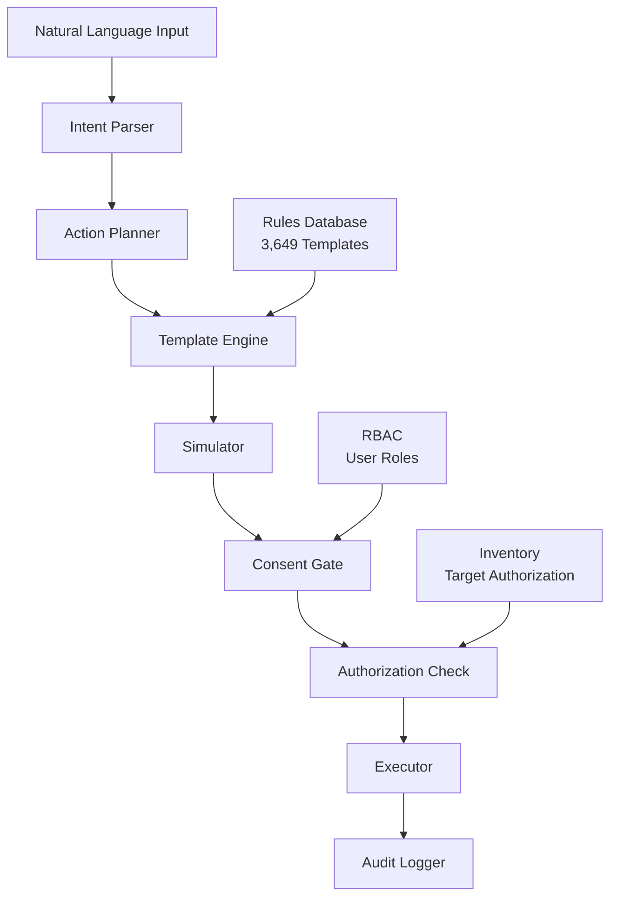

# 🛡️ FortiForge - Enterprise Security Automation Platform

**Developer:** Sud0-x | **License:** Apache 2.0 | **Status:** ✅ Production Ready

[](https://github.com/Sud0x-org/fortiforge/blob/main/SECURITY.md)
[](LICENSE)
[](https://www.python.org/downloads/)
[](#template-database)

FortiForge is an **enterprise-grade defensive security automation & orchestration platform** that converts natural language instructions into safe, auditable security configurations. Built with security-first principles, it provides comprehensive automation for OS hardening, service configuration, compliance, and network security across diverse environments.

## 🎯 Key Features

### ✅ **Natural Language Security Automation**
- **Intent-to-Action**: Convert plain English to executable security plans
- **3,649+ Templates**: Comprehensive coverage across OS, services, cloud, compliance
- **Multi-Platform**: Support for 50+ OS distributions, 200+ services, 9 cloud providers

### 🔒 **Enterprise Security Controls**
- **Simulation-First**: All operations default to safe dry-run mode
- **Explicit Consent**: Multi-layered authorization with cryptographic audit trails
- **RBAC Authentication**: Role-based access with JWT tokens (Admin/Operator/Auditor)
- **Target Authorization**: Inventory-based host approval requirements
- **Defensive-Only**: Refuses malicious patterns, offers safe alternatives

### 📊 **Production-Grade Architecture**
- **High-Performance**: Redis caching, parallel processing, full-text search
- **Scalable**: Distributed deployment support with connection pooling
- **Compliant**: CIS, NIST, ISO, PCI-DSS, SOX, HIPAA, GDPR templates
- **Observable**: Comprehensive audit logs, health monitoring, metrics

## 🚀 Quick Start

### Installation
```bash
# Clone the repository
git clone https://github.com/Sud0x-org/fortiforge.git
cd fortiforge

# Create virtual environment and install
python3 -m venv .venv
source .venv/bin/activate
pip install -e . -r requirements.txt

# Initialize audit system
fortiforge audit init-keys

# Set up inventory
mkdir -p ~/.fortiforge/inventory
cp inventory/examples/sandbox.yaml ~/.fortiforge/inventory/
```

### Basic Usage
```bash
# Create security plan from natural language
fortiforge plan "Harden nginx servers, add firewall rules to block SQLi patterns, enable fail2ban"

# Review and simulate changes (dry-run)
fortiforge plan list
fortiforge simulate <plan-id> --report changes.json

# Apply to authorized sandbox targets
fortiforge apply <plan-id> --consent="I_AUTHORIZE_CHANGES_ON_THIS_INVENTORY" --sandbox

# Start API server for web interface
fortiforge serve --host 127.0.0.1 --port 8080
```

## 📚 Template Database

FortiForge includes **3,649 enterprise security templates**:

| Category | Count | Coverage |
|----------|-------|----------|
| **OS Hardening** | 1,025 | 50+ distributions (Ubuntu, RHEL, CentOS, Debian, SUSE, Alpine...) |
| **Service Configuration** | 903 | 200+ services × 12 security categories |
| **Cloud Security** | 1,096 | AWS, Azure, GCP, Oracle, DigitalOcean, Linode... |
| **Compliance** | 92 | CIS, NIST, ISO 27001, PCI-DSS, SOX, HIPAA, GDPR |
| **Network Security** | 225 | Firewall rules (iptables, nftables, pf, cloud ACLs) |
| **IDS Signatures** | 306 | Suricata, Zeek, OSSEC, Wazuh, AIDE, Snort, Samhain |

## 🏗️ Architecture



## 🛡️ Security Guarantees

- **✅ Simulation-First**: No changes without explicit review and consent
- **✅ Multi-Layer Authorization**: Inventory → RBAC → Consent → Audit
- **✅ Cryptographic Auditing**: RSA-signed entries with verification
- **✅ Defensive Design**: Refuses offensive operations, malicious patterns
- **✅ Explicit Consent**: `I_AUTHORIZE_CHANGES_ON_THIS_INVENTORY` required
- **✅ Sandbox Mode**: Defaults to safe container-based testing

## 📖 Documentation

- **[Installation & Setup](USAGE.md)** - Complete installation and configuration guide
- **[Production Deployment](PRODUCTION_GUIDE.md)** - Enterprise deployment best practices
- **[Security Model](SECURITY.md)** - Security architecture and threat model
- **[Contributing](CONTRIBUTING.md)** - How to contribute templates and features
- **[Inventory Management](INVENTORY.md)** - Target authorization and management
- **[Playbook Creation](PLAYBOOKS.md)** - Custom automation playbook development

## 🎨 Example Use Cases

### Infrastructure Hardening
```bash
fortiforge plan "Apply CIS Level 2 benchmarks to all Ubuntu 22.04 servers"
fortiforge plan "Harden SSH configuration and disable root login"
fortiforge plan "Configure fail2ban for web servers with custom jail rules"
```

### Compliance Automation
```bash
fortiforge plan "Implement PCI-DSS requirements for payment processing systems"
fortiforge plan "Apply NIST 800-53 controls to government infrastructure"
fortiforge plan "Configure GDPR-compliant logging and data protection"
```

### Cloud Security
```bash
fortiforge plan "Secure AWS S3 buckets with encryption and access controls"
fortiforge plan "Configure Azure network security groups for web tier"
fortiforge plan "Implement GCP IAM best practices for service accounts"
```

## 🏢 Production Deployment

### Docker Deployment
```bash
# Build production container
docker build -t fortiforge:latest .

# Run with persistent storage
docker run -d \
  -p 8080:8080 \
  -v fortiforge-data:/app/data \
  -e FORTIFORGE_ALLOW_NON_SANDBOX=1 \
  fortiforge:latest
```

### Enterprise Features
- **High Availability**: Redis clustering, database replication
- **Monitoring**: Prometheus metrics, health check endpoints
- **Integration**: REST API, webhook notifications, SIEM connectors
- **Backup**: Automated configuration and audit log backups

## 🤝 Contributing

We welcome contributions! Please see [CONTRIBUTING.md](CONTRIBUTING.md) for guidelines.

### Areas for Contribution
- **Security Templates**: Additional OS, service, cloud provider templates
- **Compliance Frameworks**: New regulatory standard implementations  
- **Integrations**: SIEM, ticketing, notification system connectors
- **Documentation**: Usage examples, deployment guides, tutorials

## 📜 License

Copyright 2024 Sud0-x

Licensed under the Apache License, Version 2.0. See [LICENSE](LICENSE) for details.

## 🔒 Security

For security vulnerabilities, please email security@fortiforge.dev (not implemented yet - use GitHub issues for now)

## 📊 Project Status

- **✅ Production Ready**: Fully tested with enterprise security controls
- **✅ 3,649 Templates**: Comprehensive security automation coverage
- **✅ Multi-Platform**: Linux, cloud, container, and service support
- **✅ Enterprise Scale**: High-performance, distributed deployment ready
- **✅ Security Audited**: Defensive-only design with comprehensive safeguards

---

**⭐ Star this repository if you find FortiForge useful for your security automation needs!**
